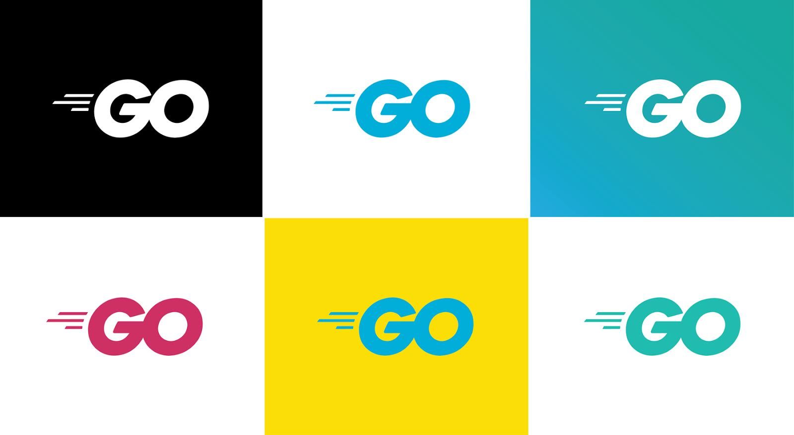

## Go в Примерах
Синтаксис Go в 65 примерах за один вечер

[Go](http://golang.org/) — это язык программирования с открытым исходным кодом, предназначенный для создания простого, быстрого и надежного программного обеспечения.

Попробовать что-то написать самому, или просто запустить какой-либо пример быстро сайте, вы можете сделать это на сайте [The Go Playground](https://play.golang.org/).

[Источник](https://gobyexample.com/)